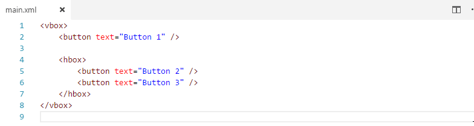

# HaxeUI support for Visual Studio Code

This is a work in progress extension for [Visual Studio Code](https://code.visualstudio.com) that adds support for the [HaxeUI](https://github.com/haxeui/haxeui-core) library.

## Features

* Preview of a UI file.
  

## Planned features

* Project generator
* Live preview
* UI builder
* CSS and UI file completion, highlighting, and diagnostics
